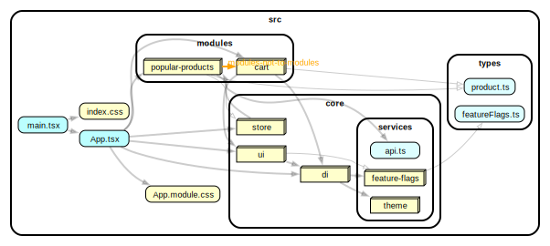
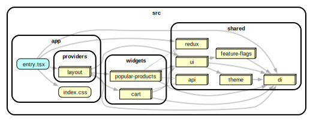
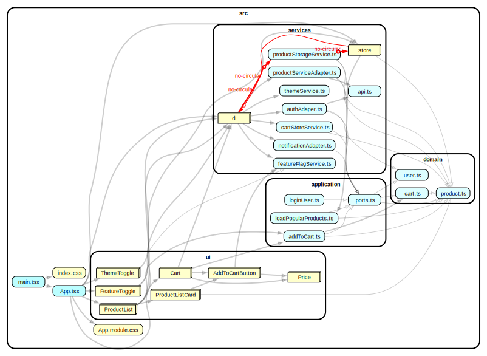

# codefest15-demo-app

See preview on https://codefest15.netlify.app (deployed `packages/modular-architecture-fsd`).

## Packages

- [`modular-architecture`](./packages/modular-architecture/) - project based on modular architecture
- [`modular-architecture-fsd`](./packages/modular-architecture-fsd/) - project based on modular architecture with feature sliced design
- [`clean-architecture`](./packages/clean-architecture/) - project based on clean architecture

## Dependencies graphs

| modular-architecture 	| modular-architecture-fsd 	| clean-architecture 	|
|---	|---	|---	|
|  	|  	|  	|
